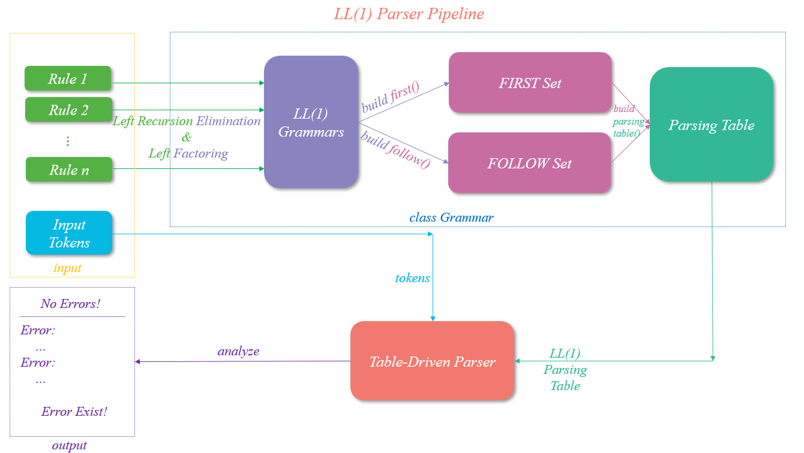

# Compiler Parser
## Intro
This repository record my assignment progress, which focuses on building up a Syntax Parser.

- [x] LL1
- [x] LR0

<!-- ## Pipeline -->
## Algorithms

在本项目支持LL(1)算法来构建语法分析器。LL(1)算法的核心是构建预测分析表，而构建预测分析表的核心是构建First集和Follow集。因此，我首先改写输入文法规则为LL(1)文法，而后实现了构建First集和Follow集的算法，然后再根据First集和Follow集构建预测分析表，最后使用预测分析表来进行语法分析。
以下是所用到的一些算法的文字说明或伪代码结构:

- Elimination of left recursion


- Left Factoring


- First Table


- Follow Table


- Parsing Table


- Table-driven predictive parsing


此外，本项目还支持使用LR(0)算法来实现自底向上的词法分析。

## Pipeline

LL1分析法的体系结构如下图所示:



## Reproduce

本项目使用makefile管理编译和测试过程，您可以使用如下命令测试本项目针对一段默认语法规则和源程序的语法分析结果：

```bash
    make clean
    make ll1 # 测试LL1分析法
    make lr0 # 测试lr0分析法
```

### Input

本项目的外界输入包括语法规则与以token为单位的源程序：

+ test/input/*_rules.txt：用于存放语法规则的文件，您可以通过阅读该文件来了解本项目所使用的语法规则。
+ test/input/*_rules_lang.txt： 用于存放token序列的文件，您可以通过阅读该文件来了解本项目所使用的模拟token序列规则。

### Output

通过调用Grammar类的.show()方法，可以展示以下辅助信息:
  + symbol table: 用于说明所有的符号并注明了终极符和非终极符
  + Rules: 用于保存所有的产生式（若程序中执行了消除左递归和左因子化操作，则会显示消除左递归和左因子化后的产生式）
  + FIRST: 针对所有符号的FIRST集
  + FOLLOW: 针对所有非终极符的FOLLOW集
  + Parsing Table： 预测分析表

通过调用LR0Parser类的.show_dfa()方法，可以展示LR(0)的识别活前缀自动机。

本项目针对给定语法规则，会为以符号为单元的源程序给出如下两类判断结果：
  + 无错误！
  + 存在错误，并打印认为有错误的符号。
## Compiler

本项目通过本地设备编译运行测试.

本次测试设备的基本信息如下:

```bash
                        'c.
                 ,xNMM.
               .OMMMMo           eric2i@bogon 
               OMMM0,            ------------ 
     .;loddo:' loolloddol;.      OS: macOS 13.4 22F66 arm64 
   cKMMMMMMMMMMNWMMMMMMMMMM0:    Host: Mac14,2 
 .KMMMMMMMMMMMMMMMMMMMMMMMWd.    Kernel: 22.5.0 
 XMMMMMMMMMMMMMMMMMMMMMMMX.      Uptime: 6 days, 23 hours, 10 mins 
;MMMMMMMMMMMMMMMMMMMMMMMM:       Packages: 100 (brew) 
:MMMMMMMMMMMMMMMMMMMMMMMM:       Shell: zsh 5.9 
.MMMMMMMMMMMMMMMMMMMMMMMMX.      Resolution: 1470x956 
 kMMMMMMMMMMMMMMMMMMMMMMMMWd.    DE: Aqua 
 .XMMMMMMMMMMMMMMMMMMMMMMMMMMk   WM: Quartz Compositor 
  .XMMMMMMMMMMMMMMMMMMMMMMMMK.   WM Theme: Blue (Light) 
    kMMMMMMMMMMMMMMMMMMMMMMd     Terminal: vscode 
     ;KMMMMMMMWXXWMMMMMMMk.      CPU: Apple M2 
       .cooc,.    .,coo:.        GPU: Apple M2 
                                 Memory: 1532MiB / 8192MiB
```

测试设备所用clang编译器版本信息如下:
```bash
  Homebrew clang version 16.0.6
  Target: arm64-apple-darwin22.5.0
  Thread model: posix
  InstalledDir: /opt/homebrew/opt/llvm/bin
```

## Git

本项目的开发使用Git进行了版本管理，您可以通过git log来查看开发过程中的历史版本信息。
