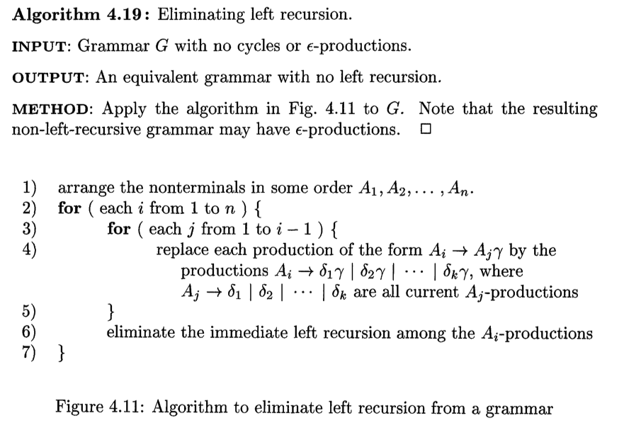
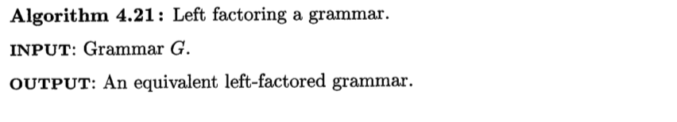
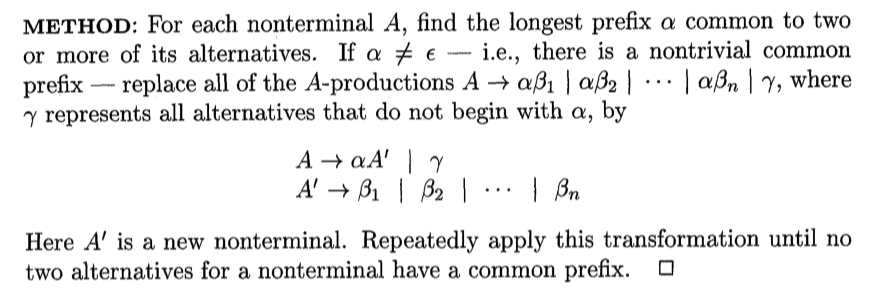
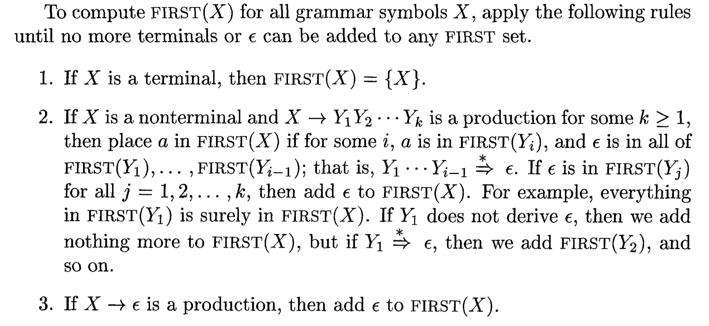
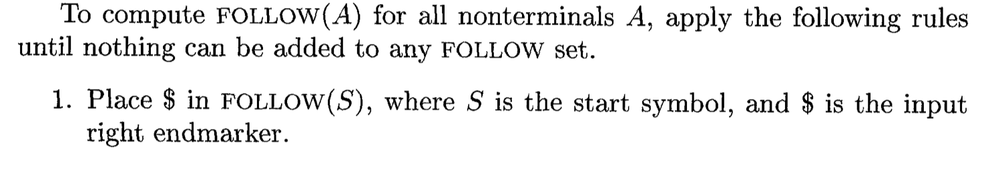
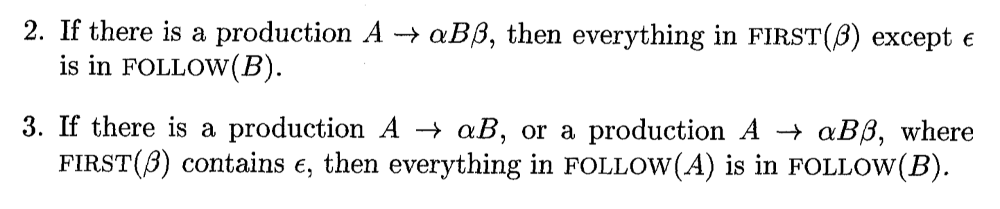
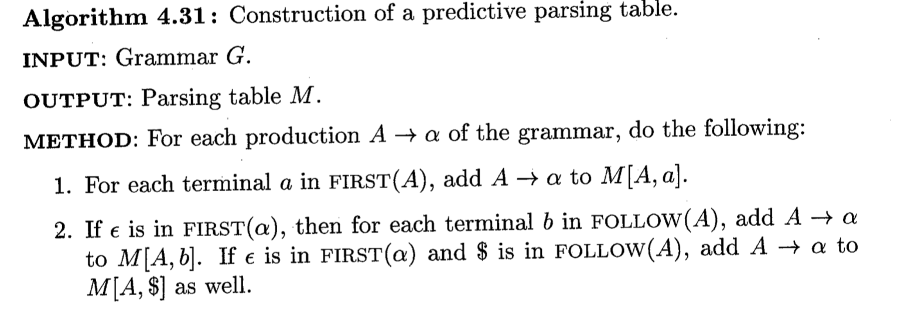
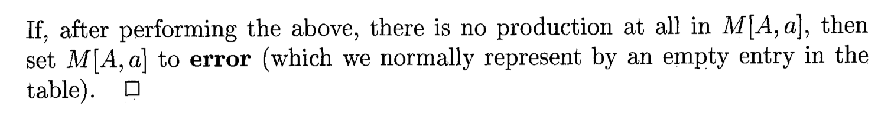
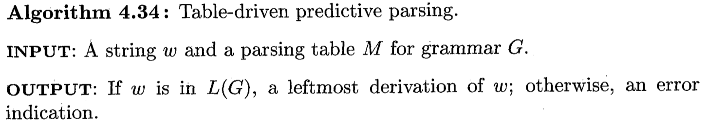

# Compiler Parser
## Intro
This repository record my assignment progress, which focuses on building up a Parser.

<!-- ## Pipeline -->
## Algorithms
- Elimination of left recursion

- Left Factoring

- First Table

- Follow Table

- Parsing Table

- Table-driven predictive parsing

## TODO
- [x] Rules input
- [x] Elimination of left recursion
- [x] Left factoring
- [x] Build up FISRT
- [x] Build up FOLLOW
- [x] Build up parsing table (LL(1))
- [x] Table-driven predictive parsing
- [ ] Error Recovery?